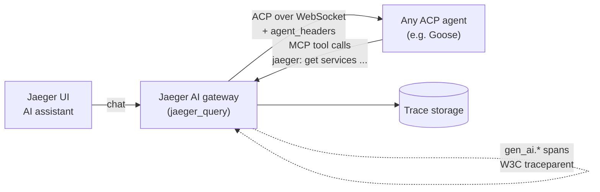

<div align="center">

<!-- Animated typing header -->
[](https://git.io/typing-svg)

<!-- Animated wave banner -->


</div>

## 🔭 About Me

- 🛰️ **LFX Mentee @ CNCF** — building the **AI Self-Service Skills Framework** for [Jaeger](https://github.com/jaegertracing/jaeger) ([tracking issue #8440](https://github.com/jaegertracing/jaeger/issues/8440))
- 🔍 I work where **Agentic AI meets Observability**: MCP tools, ACP agents, GenAI semantic conventions, and distributed traces of AI agent conversations
- 🤝 Active open-source contributor across the CNCF ecosystem — **Jaeger, Jaeger UI, OpenTelemetry Collector, Harbor** and more
- 🧠 Creator of [**CodeSight AI**](https://github.com/SoumyaRaikwar/CodeSight_AI) (agentic RAG) and co-builder of [**Acumius**](https://github.com/Acumius/Acumius) (Go)
- ✍️ Off-keyboard: swimming 🏊 and writing 📝

## 🧭 LFX Mentorship — Jaeger AI

My mentorship focuses on making Jaeger **AI-native and self-observable**: agents can discover trace-analysis playbooks ("skills") on their own, and every agent interaction is itself traced end to end.

| Area | Contributions (all merged) |
|---|---|
| 🧩 **Skills framework** | [`read_skill` MCP tool](https://github.com/jaegertracing/jaeger/pull/8849) · [operator skills via `ai.skills_dir`](https://github.com/jaegertracing/jaeger/pull/9169) · [labeled trace fixtures + E2E tests for built-in skills](https://github.com/jaegertracing/jaeger/pull/9263) · [skill-authoring & operator guide](https://github.com/jaegertracing/jaeger/pull/9435) |
| 🔭 **GenAI tracing** | [`gen_ai.*` span attributes + gateway↔sidecar W3C propagation](https://github.com/jaegertracing/jaeger/pull/8942) · [tool-call arguments/results on sidecar spans](https://github.com/jaegertracing/jaeger/pull/9011) and [gateway MCP spans](https://github.com/jaegertracing/jaeger/pull/9304) · [SEP-414 `_meta` trace-context continuation](https://github.com/jaegertracing/jaeger/pull/8361) |
| 🔌 **AI gateway / ACP** | [Configurable headers on ACP handshake](https://github.com/jaegertracing/jaeger/pull/9395) · [WebSocket message-boundary fix](https://github.com/jaegertracing/jaeger/pull/9296) · [optional `ai.mcp` config block](https://github.com/jaegertracing/jaeger/pull/9194) · [Goose-as-ACP-agent guide](https://github.com/jaegertracing/jaeger/pull/9418) |
| 💬 **Jaeger UI assistant** | [Markdown rendering + resizable panel](https://github.com/jaegertracing/jaeger-ui/pull/4181) · [tool-call rendering in chat thread](https://github.com/jaegertracing/jaeger-ui/pull/4164) |

## 🛠️ Core Stack


## 🔍 Observability & Distributed Tracing


## 🤖 Agentic AI & LLMs


## 📊 ML & Data


## 📚 Currently Learning


-10B981?style=for-the-badge&logoColor=white)
-374151?style=for-the-badge&logoColor=white)


## 🔌 ACP Work: Bring Your Own Agent to Jaeger

Jaeger's AI gateway is **bring-your-own-agent**: it dials any [ACP](https://agentclientprotocol.com/) agent over WebSocket and gives it Jaeger's telemetry as MCP tools. I built the pieces that make this work with authenticated, real-world agents:
[`ai.agent_headers` handshake auth](https://github.com/jaegertracing/jaeger/pull/9395) · [WebSocket framing fix](https://github.com/jaegertracing/jaeger/pull/9296) · [optional `ai.mcp` endpoint](https://github.com/jaegertracing/jaeger/pull/9194) · [`jaeger:` tool-call spans](https://github.com/jaegertracing/jaeger/pull/9304) · [Goose guide](https://github.com/jaegertracing/jaeger/pull/9418).



**Run an agent against Jaeger in 3 steps** (worked example with [Goose](https://github.com/aaif-goose/goose); full guide in [`scripts/ai-sidecar/goose`](https://github.com/jaegertracing/jaeger/tree/main/scripts/ai-sidecar/goose)):

```bash
# 1. Model provider (must support tool calling; OpenRouter free tier works)
export GOOSE_PROVIDER=openrouter
export GOOSE_MODEL=nvidia/nemotron-3-super-120b-a12b:free
export OPENROUTER_API_KEY=...

# 2. Start the ACP agent with authentication ON
export GOOSE_SERVER__SECRET_KEY=$(openssl rand -hex 16)
goose serve --host 127.0.0.1 --port 16688
```

```yaml
# 3. Point Jaeger at it (jaeger_query extension)
ai:
  agent_url: ws://127.0.0.1:16688/acp
  agent_headers:
    X-Secret-Key: ${env:GOOSE_SERVER__SECRET_KEY}   # secret-safe, stays out of logs
  mcp: {}                                           # exposes Jaeger telemetry as MCP tools
```

Open the Jaeger UI, ask *"list the services you can see"*, and watch `jaeger:`-prefixed tool calls stream back, each one traced with `gen_ai.*` attributes. Any other WebSocket ACP agent works the same way: only `agent_url`, the auth header name and the agent's launch command change.

## 🌍 Open Source Contributions

Merged work across the cloud-native ecosystem ([full list](https://github.com/pulls?q=is%3Apr+author%3ASoumyaRaikwar+is%3Amerged)):

| Project | Org | Focus |
|---|---|---|
| [Jaeger](https://github.com/jaegertracing/jaeger/pulls?q=is%3Apr+author%3ASoumyaRaikwar+is%3Amerged) | CNCF (Graduated) | 20+ merged PRs — MCP skills, AI gateway, GenAI instrumentation |
| [Jaeger UI](https://github.com/jaegertracing/jaeger-ui/pulls?q=is%3Apr+author%3ASoumyaRaikwar+is%3Amerged) | CNCF | AI assistant chat UX |
| [OpenTelemetry Collector](https://github.com/open-telemetry/opentelemetry-collector/pulls?q=is%3Apr+author%3ASoumyaRaikwar+is%3Amerged) & [Contrib](https://github.com/open-telemetry/opentelemetry-collector-contrib/pulls?q=is%3Apr+author%3ASoumyaRaikwar+is%3Amerged) | CNCF | Collector and component contributions |
| [Harbor](https://github.com/goharbor/harbor/pulls?q=is%3Apr+author%3ASoumyaRaikwar+is%3Amerged) | CNCF (Graduated) | Registry contribution |

Also exploring and contributing to: Kubeflow (Trainer, SDK), KubeArmor, KubeStellar, OpenYurt, PipeCD, kube-state-metrics, Kyverno.

## 🚀 Projects

| Project | What it does |
|---|---|
| 🧠 [CodeSight AI](https://github.com/SoumyaRaikwar/CodeSight_AI) | Agentic RAG over any GitHub repo — LangGraph workflow, ChromaDB retrieval, Mermaid diagrams, grounded answers |
| 🛡️ [Acumius](https://github.com/Acumius/Acumius) | Go project I co-built from scaffold through memory engine, trust layer, policy engine, API layer and governance UI (17 merged PRs) |
| 📈 [Binance Futures Trading Bot](https://github.com/SoumyaRaikwar/binance-futures-trading-bot) | Python CLI and Streamlit UI for placing orders on Binance Futures Testnet |
| 🎨 [Creative Showcase Site](https://github.com/SoumyaRaikwar/Creative-Showcase-Site) | TypeScript showcase website |

## 📈 GitHub Stats

<div align="center">


</div>

## 🌐 Connect

[](mailto:somuraik@gmail.com)
[](https://www.linkedin.com/in/soumya-raikwar)
[](https://www.soumyaraikwar.co.in/)

